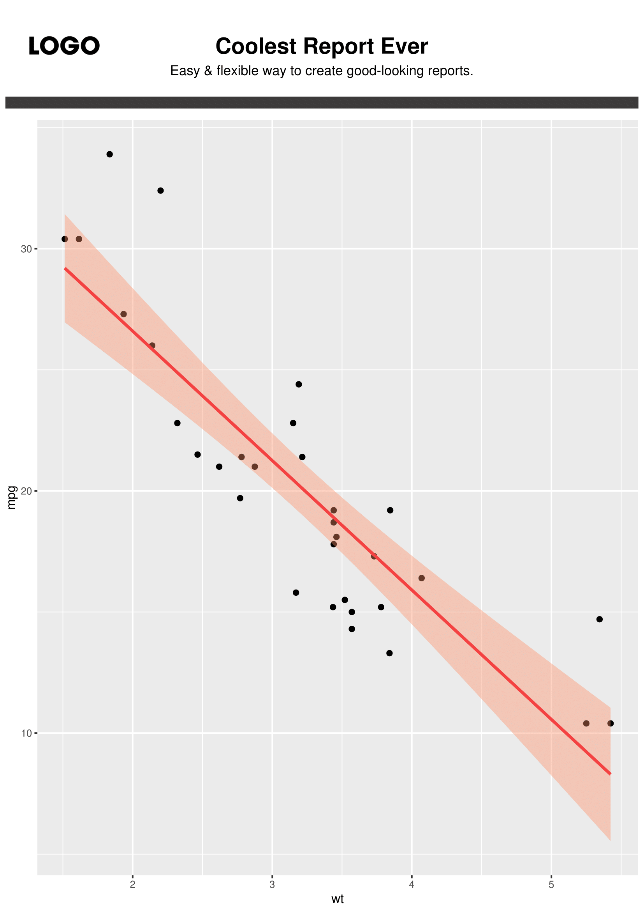

# myprettyreport

## Overview

This package helps to export ggplot2 graphs into a good-looking PDF file in a clear and easy way with a wide range of flexibility. It has a modular structure so the report elements can be combined in many ways.

Functions of the package:

* `start_report()` is the first mandatory function to generate the report.
* `add_cover_page()` function generates the cover page of the report.
* `add_new_page()` function adds a single report page to the report.
* `add_multiple_page()` function adds multiple report pages to the report.
* `end_report()` function generates the final output and closes the process.

## Installation

```{r, eval = FALSE}
#install.packages("devtools")
devtools::install_github("tarkomatas/myprettyreport")
```

## Usage

```{r, eval = FALSE}
library(ggplot2)
sample_plot <- ggplot(data = mtcars, mapping = aes(x = wt, y = mpg)) +
  geom_point() +
  stat_smooth(method = 'lm', color = "#f44242", fill = "#fd9068")

library(magick)
sample_logo <- image_read("http://myhappydata.com/img/1.png")

library(myprettyreport)
start_report() %>%

  add_cover_page(
    logo = sample_logo,
    logo_size = 0.3
  ) %>%

  add_new_page(
    plot = sample_plot,
    need_header = TRUE,
    logo = sample_logo,
    logo_size = 0.2
  ) %>%

  end_report()
```

page1             |  page2
:-------------------------:|:-------------------------:
  |  

## Additional links

[detailed introduction of the package ](https://blog.myhappydata.com/2018/11/10/detailed-introduction-of-myprettyreport-r-package/)


